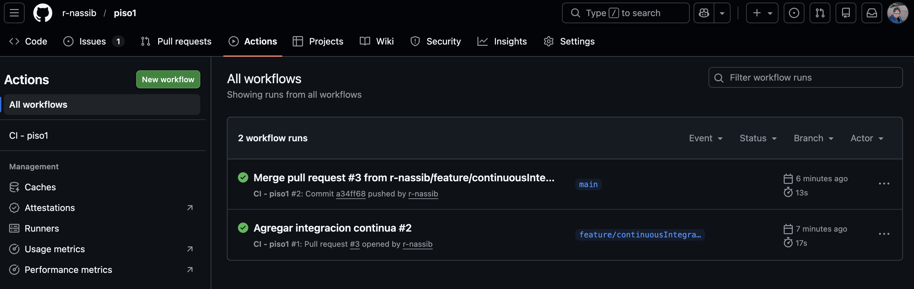

# HITO 2 — Piso1 - Integración Continua (CI)

## 1. Objetivo del hito

El objetivo de este hito es dotar al proyecto **Piso1** de un sistema de **integración continua (CI)** que permita:

- Ejecutar pruebas automáticamente ante cada cambio de código.
- Asegurar la calidad y estabilidad del proyecto.
- Definir de forma explícita la infraestructura mínima necesaria para ejecutar el código.
- Aplicar buenas prácticas de desarrollo profesional basadas en testing.

Este hito sienta las bases para los siguientes pasos del proyecto, especialmente el despliegue en la nube y la integración continua/despliegue continuo (CI/CD).

---

## 2. Gestor de tareas elegido

### Elección

Se ha elegido **npm** como gestor de tareas y dependencias, utilizando los scripts definidos en el fichero `package.json`.

### Justificación

- Es el gestor estándar del ecosistema Node.js y TypeScript.
- No introduce dependencias externas adicionales.
- Está completamente integrado con herramientas de CI como GitHub Actions.
- Permite ejecutar los tests de la misma forma tanto en local como en entornos remotos.

### Uso en el proyecto

Los tests se ejecutan mediante el comando:

```bash
npm test
```

### Biblioteca de aserciones
Se utiliza la biblioteca de aserciones expect, integrada dentro del framework de pruebas Jest.

### Justificación

Proporciona un estilo BDD (Behavior-Driven Development), con una sintaxis clara y expresiva.

Facilita la lectura de los tests, incluso para personas no directamente involucradas en su desarrollo.

Permite comparar de forma sencilla resultados esperados y obtenidos.

Está ampliamente utilizada en proyectos reales del ecosistema JavaScript/TypeScript.

Ejemplo de aserción utilizada en el proyecto:

```typescript
expect(resultado).toHaveLength(1);
expect(resultado[0].id).toBe("2");
```

### Marco de pruebas / Test Runner
Se ha elegido Jest como framework de pruebas y test runner.

La elección de Jest se basa en los siguientes criterios:

- Framework maduro y ampliamente utilizado en la industria.

- Soporte nativo para TypeScript mediante ts-jest.

- Incluye test runner, biblioteca de aserciones y sistema de mocks.

- Descubre y ejecuta los tests siguiendo convenciones estándar (*.test.ts).

- Genera informes claros sobre el estado de los tests.

Aunque existen alternativas como Mocha, Chai o Vitest, Jest ofrece una solución integrada y estable, adecuada para un proyecto académico y profesional como piso1.

### Enfoque de desarrollo basado en pruebas
En este proyecto se utiliza un enfoque BDD (Behavior-Driven Development), centrado en describir el comportamiento esperado de la lógica de negocio.

Los tests se estructuran usando bloques describe e it, facilitando la comprensión del comportamiento del sistema.

```typescript
describe("filtrarPorPrecio", () => {
  it("Devuelve solo los inmuebles dentro del rango de precio", () => {
    ...
  });
});
```

### Tests implementados
Se han implementado tests unitarios para comprobar parte de la lógica de negocio del proyecto piso1, concretamente:

Filtrado de inmuebles por rango de precio.

Esta funcionalidad es fundamental para un buscador inmobiliario, ya que permite al usuario obtener resultados relevantes en función de su presupuesto.

Ejemplo de funcionalidad probada

Función:

- filtrarPorPrecio(inmuebles, precioMin, precioMax)

Test:

- Comprueba que solo se devuelven los inmuebles cuyo precio está dentro del rango indicado.

Con esto se demuestra que los tests no son triviales ni artificiales, sino que prueban reglas reales del dominio del problema.

### Sistema de Integración Continua (CI)
Se ha elegido un **GitHub Actions** como sistema de integración continua.

Justificación

- Es un sistema gratuito y plenamente integrado con GitHub.

- Se activa automáticamente ante eventos push y pull_request.

- Permite definir pipelines declarativos mediante ficheros YAML.

- Es suficiente y adecuado para el alcance del proyecto y la asignatura.

### Configuración del pipeline de CI
La integración continua se ha configurado mediante el siguiente flujo:

- Clonación del repositorio.

- Configuración del entorno Node.js.

- Instalación de dependencias.

- Ejecución automática de los tests.

Archivo de configuración:
```bash
.github/workflows/ci.yml
```

El pipeline se ejecuta automáticamente en cada push o pull request sobre la rama principal del proyecto.

## Comprobación de los test

A continuación muestro la lista de los test que se han ido ejecutando con cada modificacion.

